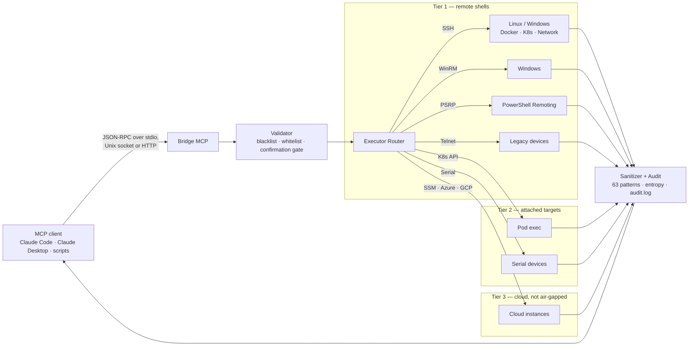

# Bridge MCP

<!-- markdownlint-disable MD033 -->
<div align="center">


[](https://github.com/muchiny/bridge-mcp/actions/workflows/ci.yml)
[](https://github.com/muchiny/bridge-mcp/releases/latest)
[](https://github.com/muchiny/bridge-mcp/releases)
[](LICENSE)
[](https://modelcontextprotocol.io)

**A Rust MCP server for secure remote infrastructure management — 476 tools, 9 protocols.**

```
Claude Code  ◄──JSON-RPC──►  Bridge MCP  ◄──9 protocols──►  Your Infrastructure
```

</div>

---

## Table of Contents

- [Features](#features)
- [Hero Workflows](#hero-workflows)
- [Quick Start](#quick-start)
- [Architecture](#architecture)
- [Configuration](#configuration)
- [Tool Groups](#tool-groups)
- [MCP Prompts & Resources](#mcp-prompts--resources)
- [CLI Usage](#cli-usage)
- [Daemon Mode](#daemon-mode)
- [Protocol Support](#protocol-support)
- [Troubleshooting](#troubleshooting)
- [Development](#development)
- [License](#license)

---

## Features

- **476 tools, 77 groups** — manage Linux, Windows, Docker, Kubernetes, Podman, AWX, databases, LDAP, network equipment, certificates, and more
- **9 protocol adapters** — SSH, WinRM, PSRP (PowerShell Remoting), Telnet, K8s Exec, Serial, AWS SSM, Azure, GCP
- **Security-first** — command whitelist/blacklist, 63 secret-redaction patterns + entropy detection, tamper-proof session recording, MCP confirmation before destructive operations (on by default)
- **Auto-discovery** — reads `~/.ssh/config` automatically, merges with YAML config
- **Smart output** — server-side `jq_filter` / `yq_filter` / `columns` / `limit`, TSV mode (60-80% token savings), pagination via `ssh_output_fetch`, per-client size limits (see [Token-efficient output](#token-efficient-output))
- **Progressive MCP discovery** — `tools/list` returns four meta-tools (`mcp_list_tool_groups`, `mcp_search_tools`, `mcp_describe_tool` to browse the registry on demand, `mcp_call_tool` to invoke what you found) instead of loading all 476 schemas up front
- **MCP 2026-07-28 (Modern) only** — `server/discover` opens the connection, per-request `_meta` carries the revision and client capabilities, notifications are opt-in via `subscriptions/listen`. A pre-Modern client sending `initialize` gets `-32022` and cannot fall forward — see [Protocol Support](#protocol-support)
- **MCP Tasks extension** — declared under `capabilities.extensions` as `io.modelcontextprotocol/tasks`, enabling polled async execution, cancellation and progress notifications for long-running operations. The SERVER decides which calls become tasks (see `task_policy::LONG_RUNNING_TOOLS`); 2026-07-28 removed per-tool `execution.taskSupport` entirely, and no tool advertises it
- **CLI + MCP** — all tools available as CLI commands (10-32x token savings) or via MCP JSON-RPC
- **Daemon mode** — Unix-socket transport for multi-client local usage; built-in `WinRmPool` (120 s TTL) and `K8sExecPool` (300 s TTL) amortize TLS handshakes across calls
- **9500+ tests** — `#![forbid(unsafe_code)]`, Rust 2024 edition, strict clippy

---

## Hero Workflows

Four end-to-end recipes that show why this exists. Every command runs through one CLI binary; all 476 tools sit behind the same flag conventions (`--jq`, `--columns`, `--limit`, `--output-format`).

### 1. Diagnose a Linux service in 4 commands

```bash
bridge-mcp status                                       # check host reachability
bridge-mcp tool ssh_service_status host=web1 service=nginx
bridge-mcp tool ssh_service_logs   host=web1 service=nginx lines=200
bridge-mcp tool ssh_journal_query  host=web1 unit=nginx priority=err since="-1h"
```

Built-in validation rejects unknown hosts before any SSH bytes leave your machine; outputs are sanitized through 63 secret-redaction patterns + entropy detection.

### 2. Inspect Kubernetes with 80% fewer tokens

```bash
# Dump all pods → 50 KB JSON. Pipe through server-side jq → ~6 KB TSV.
bridge-mcp --jq '.items[] | [.metadata.name, .status.phase, .spec.nodeName]' \
  --output-format=tsv \
  tool ssh_k8s_get host=k8s resource=pods namespace=default

bridge-mcp tool ssh_k8s_describe host=k8s resource=pod name=api-7d-xyz namespace=default
bridge-mcp tool ssh_k8s_logs     host=k8s pod=api-7d-xyz container=app tail=100
```

Filtering happens **server-side, before truncation** — you never lose data to the output cap. Same pattern works for `ssh_docker_inspect`, `ssh_helm_status`, `ssh_awx_*`, etc.

### 3. Cross-platform: Windows + Linux from one CLI

```bash
# Linux host
bridge-mcp tool ssh_service_status   host=web1 service=postgres
# Windows host (WinRM/PSRP under the hood — no agent install on the target)
bridge-mcp tool ssh_win_service_status host=appsrv service=W3SVC
bridge-mcp tool ssh_iis_restart        host=appsrv name=DefaultAppPool
bridge-mcp tool ssh_win_event_query    host=appsrv log=System level=Error since="-1h"
```

13 Windows tool groups (services, events, AD, IIS, scheduled tasks, registry, Hyper-V, …) map cleanly onto the same `ssh_*` namespace, no protocol switch in your prompts.

### 4. Audited destructive ops with confirmation

```yaml
# config.yaml
security:
  require_elicitation_on_destructive: true   # DEFAULT. Confirm any destructive_hint:true tool
audit:
  enabled: true
  path: /var/log/bridge-mcp/audit.log        # absolute, or ~/… (expanded to $HOME)
```

Session recording (tamper-proof asciinema/JSON) is driven at runtime by the
`ssh_recording_*` tools plus the `MCP_RECORDING_KEY` env var — not a config
section.

```jsonc
// Over MCP. The gate is MCP-only — see the note below the snippet.
{"method": "tools/call",
 "params": {"name": "ssh_helm_rollback",
            "arguments": {"host": "k8s", "release": "api", "revision": 7}}}
```

The server answers `resultType: "input_required"` carrying an
`elicitation/create` request and a signed `requestState`; the client gathers the
confirmation and RETRIES the same call under a new id with the answer attached.
Nothing runs until then, and the audit log records the args, sanitized stdout,
exit code and duration of the call that finally executes.

> **The CLI is not covered by this gate.** `bridge-mcp tool ssh_helm_rollback …`
> has no client to ask and never prompts. Confirmation is an MCP-mode control;
> the CLI's protection is the blacklist and the audit log.

The dispatcher distinguishes `read_only` vs `mutating` vs `mutating_idempotent` vs `destructive` per tool (audited via `tests/annotation_audit.rs`), so confirmations only fire when state actually changes.

---

## Quick Start

### 1. Install

```bash
# Linux x86_64 (recommended)
curl -fsSL https://github.com/muchiny/bridge-mcp/releases/latest/download/bridge-mcp-linux-x86_64.tar.gz | tar xz
sudo mv bridge-mcp /usr/local/bin/
```

<details>
<summary>Other platforms & methods</summary>

```bash
# Linux aarch64 (Raspberry Pi, ARM servers)
curl -fsSL https://github.com/muchiny/bridge-mcp/releases/latest/download/bridge-mcp-linux-arm64.tar.gz | tar xz
sudo mv bridge-mcp /usr/local/bin/

# macOS (Apple Silicon)
curl -fsSL https://github.com/muchiny/bridge-mcp/releases/latest/download/bridge-mcp-macos-arm64.tar.gz | tar xz
sudo mv bridge-mcp /usr/local/bin/

# Docker
docker pull ghcr.io/muchiny/bridge-mcp:latest

# From source
git clone https://github.com/muchiny/bridge-mcp && cd bridge-mcp && make release
```

**Claude Desktop (DXT):** download the `.dxt` file from [Releases](https://github.com/muchiny/bridge-mcp/releases/latest) and drag-and-drop into Claude Desktop.

</details>

> **Claude Code plugin (one command).** Install the plugin from the marketplace — it registers the `/bridge-mcp:bridge` and `/bridge-mcp:discover` skills, the MCP server, and a binary-bootstrap hook:
>
> ```bash
> claude plugin marketplace add muchiny/bridge-mcp
> claude plugin install bridge-mcp@muchiny
> cargo install --git https://github.com/muchiny/bridge-mcp --features full   # the binary the plugin drives
> ```
>
> The skills auto-trigger when you mention a remote host, Docker, Kubernetes, services, logs, ports, etc.

### 2. Configure

```bash
mkdir -p ~/.config/bridge-mcp
cp config/config.example.yaml ~/.config/bridge-mcp/config.yaml
chmod 600 ~/.config/bridge-mcp/config.yaml   # required — the server rejects
                                             # group/other-readable config (it may hold secrets)
```

> The config may contain SSH keys, sudo passwords and tokens, so bridge-mcp
> refuses to start if `config.yaml` is group- or world-accessible (max `0640`).
> A fresh `cp` usually lands at `0644` — run the `chmod` above.

Edit `~/.config/bridge-mcp/config.yaml` with your hosts:

```yaml
hosts:
  my-server:
    hostname: 192.168.1.100
    port: 22
    user: admin
    auth:
      type: key
      path: ~/.ssh/id_ed25519
    description: "My server"
```

> **Tip:** Hosts from `~/.ssh/config` are auto-discovered — you may not need to configure anything.

**Recommended safe defaults** — add these so Claude confirms before anything
irreversible and every action is logged:

```yaml
security:
  mode: standard                             # blacklist + whitelist for ssh_exec
  require_elicitation_on_destructive: true   # DEFAULT; set false to run destructive tools unconfirmed
audit:
  enabled: true
  path: ~/.local/share/bridge-mcp/audit.log  # ~ expands to $HOME; absolute paths also fine
```

Only the 8 core tool groups are enabled by default (secure-by-default) — opt
into the rest under `tool_groups` (see [Tool Groups](#tool-groups); the example
config ships ready-to-use K3s and Docker profiles).

### 3. Add to Claude Code

Add to `~/.claude/settings.json`:

```json
{
  "mcpServers": {
    "ssh-bridge": {
      "command": "bridge-mcp"
    }
  }
}
```

> **Your MCP host must speak MCP 2026-07-28.** bridge-mcp 3.x removed the
> `initialize` handshake; a host that opens with `initialize` receives
> `-32022 Unsupported protocol version` and the connection is dead. If your
> host is not there yet, stay on **v1.20.0** — the last release that speaks the
> Legacy handshake. There is no 2.x to fall back to: `2.0.0` through `2.2.0`
> were written but never tagged or published, and those numbers are burnt (see
> the note under the 2.2.0 heading in [CHANGELOG.md](CHANGELOG.md)). The
> CLI-as-tool mode (`bridge-mcp tool …`) is unaffected either way, because it
> never speaks JSON-RPC at all.

> **Claude Code needs one setting, or it sends the Legacy handshake.** Measured
> on 2.1.239: it implements 2026-07-28 fully, but defaults stdio servers to the
> Legacy path, so it opens with `initialize` and sees ZERO tools. Turn
> negotiation on:
>
> ```json
> { "env": { "MCP_PROTOCOL_NEGOTIATION": "auto" } }
> ```
>
> in `.claude/settings.json` (or `settings.local.json`), then restart. Verify
> with `claude mcp list` — the server should read `✔ Connected`. Check your own
> client's behaviour before assuming; the symptom of getting this wrong is an
> empty tool list, not an error message.

### 4. Verify

Restart Claude Code, then ask: *"Check the health of my-server"* — or run:

```bash
bridge-mcp status
```

---

## Architecture

Bridge MCP sits between Claude Code and your infrastructure. It routes commands through 9 protocol adapters with built-in security validation, output sanitization, and audit logging.



The validator runs **before** the command leaves the machine; the sanitizer runs
**after**, on what comes back (`src/domain/use_cases/execute_command.rs`), so a
secret in stdout is redacted on the return path rather than filtered on the way
out. Tier numbering matches the protocol feature flags in `Cargo.toml`; SSH is
always compiled in, every other adapter is opt-in.

---

## Configuration

Config file: `~/.config/bridge-mcp/config.yaml` — see [config.example.yaml](config/config.example.yaml) for full reference.

<details>
<summary><strong>Authentication methods</strong></summary>

| Method | Config | Notes |
|--------|--------|-------|
| SSH Key | `type: key` + `path: ~/.ssh/id_ed25519` | Recommended. Supports optional `passphrase`. |
| SSH Agent | `type: agent` | Uses `SSH_AUTH_SOCK`. Recommended. |
| Password | `type: password` + `password: "..."` | Avoid if possible. |

Verify your SSH access first: `ssh user@hostname "echo OK"`

</details>

<details>
<summary><strong>Security rules</strong></summary>

Three modes control which commands Claude can run:

| Mode | Behavior |
|------|----------|
| `strict` | Only whitelisted commands allowed (safest) |
| `standard` | Whitelist for `ssh_exec`, built-in tools only check blacklist (default) |
| `permissive` | Only blacklist checked (most open) |

The **blacklist is always checked first** — matched commands are always denied.

```yaml
security:
  mode: standard
  whitelist:
    - "^docker\\s+(ps|logs|inspect).*"
    - "^kubectl\\s+(get|describe|logs).*"
    - "^(ls|cat|head|tail|grep|df|free)\\s*.*"
  blacklist:
    - "rm\\s+(-[a-zA-Z]*r|--(recursive|force))"
    - "mkfs\\."
    - "dd\\s+if="
    - "curl.*\\|.*sh"
```

</details>

<details>
<summary><strong>Advanced hosts (jump hosts, SOCKS proxy, Windows, sudo)</strong></summary>

**Jump hosts (bastion):**

```yaml
hosts:
  bastion:
    hostname: bastion.example.com
    user: admin
    auth: { type: agent }

  internal-db:
    hostname: 10.0.0.5
    proxy_jump: bastion
    user: deploy
    auth: { type: key, path: ~/.ssh/id_ed25519 }
```

**SOCKS proxy:**

```yaml
hosts:
  behind-proxy:
    hostname: 10.0.0.50
    user: deploy
    socks_proxy:
      hostname: proxy.corp.com
      port: 1080
      version: socks5
    auth: { type: key, path: ~/.ssh/id_ed25519 }
```

> `proxy_jump` and `socks_proxy` are mutually exclusive on the same host.

**Windows servers** — set `os_type: windows` so tools use Windows/PowerShell
command semantics (the 74 Windows-specific tools live in the 13 Windows groups;
enable them under `tool_groups` like any other group):

```yaml
hosts:
  windows-dc:
    hostname: 192.168.1.200
    user: Administrator
    os_type: windows
    shell: powershell
    auth: { type: key, path: ~/.ssh/id_ed25519 }
```

**Sudo support:**

```yaml
hosts:
  prod-server:
    hostname: 192.168.1.100
    user: deploy
    sudo_password: "your-sudo-password"
    auth: { type: key, path: ~/.ssh/id_ed25519 }
```

**SSH config auto-discovery** — hosts from `~/.ssh/config` are merged automatically. To exclude specific hosts:

```yaml
ssh_config:
  enabled: true
  exclude: [personal-server]
```

</details>

<details>
<summary><strong>Limits, sanitization & audit</strong></summary>

**Limits:**

```yaml
limits:
  command_timeout_seconds: 60
  connection_timeout_seconds: 10
  max_concurrent_commands: 5
  max_output_chars: 40000          # this is the default; 0 = unlimited
  rate_limit_per_second: 0         # 0 = disabled
  retry_attempts: 3
  client_overrides:                # Per-client output limits
    - name_contains: claude
      max_output_chars: 80000
```

Truncated outputs include an `output_id` — use `ssh_output_fetch` to retrieve the full content page by page.

**Output sanitization** — 63 built-in regex patterns + Shannon entropy detection for secrets:

```yaml
security:
  sanitize:
    enabled: true
    entropy_detection: true
    entropy_threshold: 4.5
    custom_patterns:
      - pattern: "INTERNAL_[A-Z0-9]{32}"
        replacement: "[INTERNAL_REDACTED]"
```

**Destructive-op confirmation** — **on by default.** Before any tool annotated
`destructive_hint: true` (`ssh_terraform_apply`, `ssh_k8s_delete`,
`ssh_cron_remove`, `ssh_win_update_reboot`, …) executes, the server answers
`resultType: "input_required"` with an `elicitation/create` request and an
integrity-protected `requestState`. The client gathers the confirmation and
retries the same call under a new id with the answer attached; only then does
the tool run.

The gate reads `_meta["io.modelcontextprotocol/clientCapabilities"].elicitation`
**on the request that calls the tool**, and is fail-closed: a request that does
not declare elicitation is refused rather than executed unconfirmed.

Two properties worth knowing before you rely on it:

- **An answer counts only with the `requestState` the server signed for that
  exact call.** Without that binding a client could send
  `inputResponses: {"confirm_destructive": {"action": "accept"}}` on its FIRST
  call and confirm on the user's behalf. The state binds the tool name AND its
  arguments, so a confirmation for `ssh_exec rm /tmp/x` cannot authorise
  `ssh_exec rm /`.
- **This flag is the WHOLE confirmation policy.** Nineteen handlers used to ask
  a second time on their own, independently of it. They no longer do — one
  question per operation. If you had the flag off and relied on the per-handler
  prompt, turn it on.

**MCP mode only.** `bridge-mcp tool …` on the CLI has no client to ask and never
prompts, so do not treat the CLI as covered by this control:

```yaml
security:
  require_elicitation_on_destructive: true  # default: true — set false to opt OUT
```

**Audit logging:**

```yaml
audit:
  enabled: true
  path: ~/.local/share/bridge-mcp/audit.log
  max_size_mb: 100
  retain_days: 30
```

**Session recording** — asciinema v2 format with HMAC-SHA256 hash-chain (SOC2,
HIPAA, PCI-DSS). This is **not** a YAML config section (the schema rejects
unknown keys); it is driven at runtime by the `ssh_recording_*` tools (enable
the `recording` tool group) with the HMAC key supplied via the
`MCP_RECORDING_KEY` environment variable. Recordings are written as `.cast`
files.

</details>

---

## Tool Groups

476 tools organized in 77 groups. Secure by default: only the eight core groups
(`core`, `file_ops`, `directory`, `process`, `monitoring`, `network`, `systemd`,
`sessions`) are enabled out of the box — everything else (containers, K8s,
Windows, cloud, …) is opt-in. Enable the groups you need, or disable defaults:

```yaml
tool_groups:
  groups:
    docker: true       # opt in to a non-default group
    kubernetes: true
    sessions: false    # opt out of a default group
```

<details>
<summary><strong>Linux & cross-platform groups (43 groups)</strong></summary>

Representative tools per group — larger groups (e.g. `kubernetes` has 83,
`awx` 43) list only the common ones. For the full set of any group, run
`bridge-mcp list-tools --group <name>`.

| Group | Tools |
|-------|-------|
| `core` | ssh_exec, ssh_exec_multi (with `diff` / `diff_baseline` / `normalize` for cross-host drift detection), ssh_status, ssh_health, ssh_history, ssh_output_fetch |
| `config` | ssh_config_get, ssh_config_set |
| `file_transfer` | ssh_upload, ssh_download, ssh_sync |
| `file_ops` | ssh_file_read, ssh_file_write, ssh_files_write, ssh_file_chmod, ssh_file_chown, ssh_file_stat, ssh_file_diff, ssh_file_patch, ssh_file_template |
| `sessions` | ssh_session_create, ssh_session_exec, ssh_session_list, ssh_session_close |
| `monitoring` | ssh_metrics, ssh_metrics_multi, ssh_tail, ssh_disk_usage |
| `tunnels` | ssh_tunnel_create, ssh_tunnel_list, ssh_tunnel_close |
| `directory` | ssh_ls, ssh_find |
| `database` | ssh_db_query, ssh_db_dump, ssh_db_restore |
| `redis` | ssh_redis_info, ssh_redis_cli, ssh_redis_keys |
| `postgresql` | ssh_postgresql_query, ssh_postgresql_status |
| `mysql` | ssh_mysql_query, ssh_mysql_status |
| `mongodb` | ssh_mongodb_status |
| `backup` | ssh_backup_create, ssh_backup_list, ssh_backup_restore, ssh_backup_snapshot, ssh_backup_verify, ssh_backup_schedule |
| `docker` | ssh_docker_ps, ssh_docker_logs, ssh_docker_inspect, ssh_docker_exec, ssh_docker_compose, ssh_docker_images, ssh_docker_stats, ssh_docker_volume_ls, ssh_docker_network_ls, ssh_docker_volume_inspect, ssh_docker_network_inspect |
| `podman` | ssh_podman_ps, ssh_podman_logs, ssh_podman_inspect, ssh_podman_exec, ssh_podman_images, ssh_podman_compose |
| `esxi` | ssh_esxi_vm_list, ssh_esxi_vm_info, ssh_esxi_vm_power, ssh_esxi_snapshot, ssh_esxi_host_info, ssh_esxi_datastore_list, ssh_esxi_network_list |
| `cri` | ssh_crictl_ps, ssh_crictl_pods, ssh_crictl_images, ssh_crictl_logs, ssh_crictl_inspect, ssh_crictl_stats, ssh_crictl_info, ssh_crictl_exec, ssh_crictl_rmi (works when the apiserver is down) |
| `k3s` | ssh_k3s_status, ssh_k3s_check_config, ssh_k3s_etcd_status, ssh_k3s_etcd_snapshot_save/list/restore, ssh_k3s_ctr_images, ssh_k3s_kubeconfig_get, ssh_k3s_config_get, ssh_k3s_servicelb_status, ssh_k3s_addon_manifests, ssh_k3s_upgrade, ssh_k3s_uninstall, ssh_k3s_killall, ssh_k3s_cert_rotate |
| `kubernetes` | ssh_k8s_get, ssh_k8s_logs, ssh_k8s_describe, ssh_k8s_apply, ssh_k8s_delete, ssh_k8s_rollout, ssh_k8s_scale, ssh_k8s_exec, ssh_k8s_top, ssh_helm_list, ssh_helm_status, ssh_helm_upgrade, ssh_helm_install, ssh_helm_rollback, ssh_helm_history, ssh_helm_uninstall, … (83 total — `list-tools --group kubernetes`) |
| `git` | ssh_git_status, ssh_git_log, ssh_git_diff, ssh_git_pull, ssh_git_clone, ssh_git_branch, ssh_git_checkout |
| `ansible` | ssh_ansible_playbook, ssh_ansible_inventory, ssh_ansible_adhoc |
| `awx` | ssh_awx_status, ssh_awx_inventories, ssh_awx_inventory_hosts, ssh_awx_templates, ssh_awx_template_detail, ssh_awx_job_launch, ssh_awx_job_status, ssh_awx_job_summary, ssh_awx_job_stdout, ssh_awx_job_events, ssh_awx_job_follow, ssh_awx_job_cancel, ssh_awx_project_sync, … (43 total — workflows, approvals, relaunch) |
| `terraform` | ssh_terraform_init, ssh_terraform_plan, ssh_terraform_apply, ssh_terraform_state, ssh_terraform_output |
| `vault` | ssh_vault_status, ssh_vault_read, ssh_vault_list, ssh_vault_write |
| `systemd` | ssh_service_status, ssh_service_start, ssh_service_stop, ssh_service_restart, ssh_service_list, ssh_service_logs, ssh_service_enable, ssh_service_disable, ssh_service_daemon_reload |
| `systemd_timers` | ssh_timer_list, ssh_timer_info, ssh_timer_enable, ssh_timer_disable, ssh_timer_trigger |
| `network` | ssh_net_connections, ssh_net_interfaces, ssh_net_routes, ssh_net_ping, ssh_net_traceroute, ssh_net_dns |
| `process` | ssh_process_list, ssh_process_kill, ssh_process_top |
| `package` | ssh_pkg_list, ssh_pkg_search, ssh_pkg_install, ssh_pkg_update, ssh_pkg_remove |
| `firewall` | ssh_firewall_status, ssh_firewall_list, ssh_firewall_allow, ssh_firewall_deny |
| `cron` | ssh_cron_list, ssh_cron_add, ssh_cron_remove |
| `cron_analysis` | ssh_cron_analyze, ssh_cron_history, ssh_at_jobs |
| `certificates` | ssh_cert_check, ssh_cert_info, ssh_cert_expiry |
| `letsencrypt` | ssh_letsencrypt_status |
| `nginx` | ssh_nginx_status, ssh_nginx_test, ssh_nginx_reload, ssh_nginx_list_sites |
| `apache` | ssh_apache_status, ssh_apache_vhosts |
| `user_management` | ssh_user_list, ssh_user_info, ssh_user_add, ssh_user_modify, ssh_user_delete, ssh_group_list, ssh_group_add, ssh_group_delete |
| `storage` | ssh_storage_lsblk, ssh_storage_df, ssh_storage_mount, ssh_storage_umount, ssh_storage_lvm, ssh_storage_fdisk, ssh_storage_fstab |
| `journald` | ssh_journal_query, ssh_journal_follow, ssh_journal_boots, ssh_journal_disk_usage |
| `security_modules` | ssh_selinux_status, ssh_selinux_booleans, ssh_apparmor_status, ssh_apparmor_profiles, ssh_security_audit |
| `network_equipment` | ssh_net_equip_show_run, ssh_net_equip_show_interfaces, ssh_net_equip_show_routes, ssh_net_equip_show_arp, ssh_net_equip_show_version, ssh_net_equip_show_vlans, ssh_net_equip_config, ssh_net_equip_save |
| `ldap` | ssh_ldap_search, ssh_ldap_user_info, ssh_ldap_group_members, ssh_ldap_add, ssh_ldap_modify |

</details>

<details>
<summary><strong>Windows groups (13 groups)</strong></summary>

| Group | Tools |
|-------|-------|
| `windows_services` | ssh_win_service_list, ssh_win_service_status, ssh_win_service_start, ssh_win_service_stop, ssh_win_service_restart, ssh_win_service_enable, ssh_win_service_disable, ssh_win_service_config |
| `windows_events` | ssh_win_event_query, ssh_win_event_logs, ssh_win_event_sources, ssh_win_event_tail, ssh_win_event_export |
| `active_directory` | ssh_ad_user_list, ssh_ad_user_info, ssh_ad_group_list, ssh_ad_group_members, ssh_ad_computer_list, ssh_ad_domain_info |
| `scheduled_tasks` | ssh_schtask_list, ssh_schtask_info, ssh_schtask_run, ssh_schtask_enable, ssh_schtask_disable |
| `windows_firewall` | ssh_win_firewall_status, ssh_win_firewall_list, ssh_win_firewall_allow, ssh_win_firewall_deny, ssh_win_firewall_remove |
| `iis` | ssh_iis_list_sites, ssh_iis_list_pools, ssh_iis_status, ssh_iis_start, ssh_iis_stop, ssh_iis_restart |
| `windows_updates` | ssh_win_update_list, ssh_win_update_search, ssh_win_update_install, ssh_win_update_history, ssh_win_update_reboot |
| `windows_perf` | ssh_win_perf_overview, ssh_win_perf_cpu, ssh_win_perf_memory, ssh_win_perf_disk, ssh_win_perf_network, ssh_win_disk_usage |
| `hyperv` | ssh_hyperv_vm_list, ssh_hyperv_vm_info, ssh_hyperv_vm_start, ssh_hyperv_vm_stop, ssh_hyperv_host_info, ssh_hyperv_switch_list, ssh_hyperv_snapshot_list, ssh_hyperv_snapshot_create |
| `windows_registry` | ssh_reg_query, ssh_reg_list, ssh_reg_set, ssh_reg_delete, ssh_reg_export |
| `windows_features` | ssh_win_feature_list, ssh_win_feature_info, ssh_win_feature_install, ssh_win_feature_remove |
| `windows_network` | ssh_win_net_ip, ssh_win_net_adapters, ssh_win_net_connections, ssh_win_net_routes, ssh_win_net_ping, ssh_win_net_dns |
| `windows_process` | ssh_win_process_list, ssh_win_process_top, ssh_win_process_info, ssh_win_process_by_name, ssh_win_process_kill |

</details>

<details>
<summary><strong>Advanced groups (21 groups)</strong></summary>

| Group | Tools | Description |
|-------|-------|-------------|
| `diagnostics` | ssh_diagnose, ssh_incident_triage, ssh_compare_state | Intelligent single-call diagnostics with symptom-based triage |
| `runbooks` | ssh_runbook_list, ssh_runbook_execute, ssh_runbook_validate | YAML-defined multi-step operational procedures ([docs](config/runbooks/README.md)) |
| `orchestration` | ssh_canary_exec, ssh_rolling_exec, ssh_fleet_diff | Canary deployments, rolling updates, fleet-wide comparison |
| `recording` | ssh_recording_start, ssh_recording_stop, ssh_recording_list, ssh_recording_replay, ssh_recording_verify | Tamper-proof session recording (SOC2/HIPAA/PCI-DSS) |
| `drift` | ssh_env_snapshot, ssh_env_diff, ssh_env_drift | Environment state capture and drift detection |
| `security_scan` | ssh_sbom_generate, ssh_vuln_scan, ssh_compliance_check | SBOM, vulnerability scanning, CIS compliance checks |
| `performance` | ssh_perf_trace, ssh_io_trace, ssh_latency_test, ssh_benchmark | Performance profiling, I/O tracing, benchmarks |
| `container_logs` | ssh_container_log_search, ssh_container_log_stats, ssh_container_events, ssh_container_health_history | Container log analysis and health tracking |
| `network_security` | ssh_port_scan, ssh_ssl_audit, ssh_network_capture, ssh_fail2ban_status | Port scanning, SSL audit, traffic capture, fail2ban |
| `compliance` | ssh_cis_benchmark, ssh_stig_check, ssh_compliance_score, ssh_compliance_report | CIS/STIG benchmarks and compliance reporting |
| `cloud` | ssh_aws_cli, ssh_cloud_metadata, ssh_cloud_tags, ssh_cloud_cost | Cloud provider interaction |
| `inventory` | ssh_discover_hosts, ssh_inventory_sync, ssh_host_tags | Host discovery and CMDB sync |
| `multicloud` | ssh_multicloud_list, ssh_multicloud_sync, ssh_multicloud_compare | Multi-cloud resource management |
| `alerting` | ssh_alert_check, ssh_alert_list, ssh_alert_set | Metric monitoring, threshold checking, alert rules |
| `capacity` | ssh_capacity_collect, ssh_capacity_trend, ssh_capacity_predict | Capacity data collection, trending, prediction |
| `incident` | ssh_incident_timeline, ssh_incident_correlate | Incident response timeline and log correlation |
| `log_aggregation` | ssh_log_aggregate, ssh_log_search_multi, ssh_log_tail_multi | Cross-host log aggregation, search, tail |
| `key_management` | ssh_key_generate, ssh_key_distribute, ssh_key_audit | SSH key generation, distribution, audit |
| `chatops` | ssh_webhook_send, ssh_notify | Slack/Teams/webhook notifications |
| `templates` | ssh_template_list, ssh_template_show, ssh_template_apply, ssh_template_validate, ssh_template_diff | Config template management |
| `pty` | ssh_pty_exec, ssh_pty_interact, ssh_pty_resize | Interactive PTY sessions |

</details>

---

## MCP Prompts & Resources

<details>
<summary><strong>Pre-built prompts</strong></summary>

| Prompt | Description | Required args |
|--------|-------------|---------------|
| `system-health` | Full system health check (CPU, memory, disk, services) | `host` |
| `deploy` | Step-by-step deployment workflow | `host`, `service` |
| `security-audit` | Security posture assessment | `host` |
| `troubleshoot` | Systematic troubleshooting guide | `host`, `symptom` |
| `docker-health` | Docker/container health assessment | `host` |
| `k8s-overview` | Kubernetes cluster state overview | `host` |
| `backup-verify` | Backup integrity verification | `host` |

</details>

<details>
<summary><strong>Direct data resources</strong></summary>

| URI pattern | Description |
|-------------|-------------|
| `metrics://{host}` | System metrics (CPU, memory, disk, network, load) as JSON |
| `file://{host}/{+path}` | Remote file content |
| `log://{host}/{+path}` | Last lines of a log file |
| `health://{host}` | Health check summary for a host (connectivity, load, key services) |
| `history://{host}` | Recent command history captured by the bridge for that host |
| `services://{host}` | Snapshot of active systemd services on the host |

</details>

---

## CLI Usage

The binary works standalone (outside MCP mode) with **10-32x token savings** for AI agent workflows.

### Basic commands

```bash
bridge-mcp status                       # Show configured hosts & security
bridge-mcp exec <host> "<command>"      # Execute a command directly
bridge-mcp history [--limit 20]         # Show command history
bridge-mcp upload <host> <local> <remote>   # SFTP upload
bridge-mcp download <host> <remote> <local> # SFTP download
bridge-mcp validate                     # Validate config file
bridge-mcp config-diff                  # Compare config vs defaults
```

### Tool invocation (all 476 MCP tools)

```bash
# Invoke any tool with key=value pairs
bridge-mcp tool ssh_docker_ps host=prod
bridge-mcp tool ssh_exec host=prod command="df -h"

# Or with JSON arguments
bridge-mcp tool ssh_k8s_get --json-args '{"host":"k8s","resource":"pods","namespace":"default"}'

# JSON output (for scripting/parsing)
bridge-mcp --json tool ssh_docker_ps host=prod
```

### Progressive discovery

From the CLI:

```bash
bridge-mcp list-tools --groups-only       # 77 groups (~2K tokens)
bridge-mcp list-tools --group docker      # Tools in a group (~500 tokens)
bridge-mcp list-tools --search kubernetes # Keyword search
bridge-mcp describe-tool ssh_docker_ps    # Full schema for 1 tool (~200 tokens)
```

From an MCP client (Claude Desktop / Claude Code), the same progressive-discovery pattern is available as three top-level tools so the model can walk the registry without loading all 476 schemas up front:

| Tool | Purpose | Typical cost |
|---|---|---|
| `mcp_list_tool_groups` | List the 77 groups with counts | ~2 K tokens |
| `mcp_search_tools` | Keyword search (`query`, `group?`, `limit=20`) | ~3 K tokens / page |
| `mcp_describe_tool` | Full schema + reduction strategy for one tool | ~500 tokens |

### Token-efficient output

Every tool automatically exposes reduction parameters based on its output type. Server-side filtering runs **before** truncation, so you never lose data to the output cap. Use `describe-tool <name>` — its top-of-output **Reduction Strategy** line tells you exactly which params apply.

| Output kind | Available params | Strategy | Example tools |
|---|---|---|---|
| **Tabular** | `columns`, `limit` | Pick columns + cap rows | `docker_ps`, `service_list`, `process_list` |
| **Json** | `jq_filter`, `output_format`, `limit` | jq + TSV for 60-80% savings | `docker_inspect`, `k8s_get`, `ansible_facts` |
| **Yaml** | `yq_filter`, `output_format`, `limit` | yq + TSV | kubectl/helm YAML output |
| **Auto** | All of the above | Tool auto-detects JSON vs tabular | `vault_status`, mixed outputs |
| **RawText** | — | `save_output=/path` then read the file locally | `ssh_exec`, logs, arbitrary commands |

**Common params** available on every tool: `host`, `timeout_seconds`, `max_output`, `save_output`.

```bash
# Filter JSON with jq + TSV output (60-80% token savings on list data)
bridge-mcp tool ssh_k8s_get host=k8s resource=pods \
  jq_filter='.items[] | [.metadata.name, .status.phase]' output_format=tsv

# Pick columns from tabular output
bridge-mcp tool ssh_docker_ps host=prod columns='["NAMES","STATUS","IMAGE"]' limit=20

# Or use the ergonomic global flags (equivalent)
bridge-mcp --jq '.items[] | {name, phase}' --output-format=tsv tool ssh_k8s_get host=k8s resource=pods
bridge-mcp --columns NAMES,STATUS,IMAGE --limit 20 tool ssh_docker_ps host=prod

# Persist full untruncated output to a file
bridge-mcp tool ssh_docker_logs host=prod container=nginx save_output=/tmp/nginx.log
```

**Pagination.** Truncated results print `[output_id: abc123]`. Fetch the rest with:

```bash
bridge-mcp tool ssh_output_fetch output_id=abc123 offset=40000
```

### Global flags

| Flag | Description |
|------|-------------|
| `--config` / `-c` | Path to config file |
| `--json` | JSON output for all commands |
| `--dry-run` | Preview without executing |

### Exit codes

| Code | Meaning |
|------|---------|
| 0 | Success |
| 1 | Tool/command execution error |
| 2 | CLI usage error (unknown tool, bad args) |
| 3 | SSH connection error |
| 4 | Security denial |
| 5 | Configuration error |

### Shell completions

```bash
bridge-mcp completions bash > ~/.bash_completion.d/bridge-mcp
bridge-mcp completions zsh > ~/.zfunc/_bridge-mcp
bridge-mcp completions fish > ~/.config/fish/completions/bridge-mcp.fish
```

### Claude Code integration (optional)

If you use [Claude Code](https://claude.com/claude-code), copy the provided rule and skill to get CLI-aware assistance:

```bash
# Copy the CLI rule (tells Claude to prefer CLI over MCP for token efficiency)
mkdir -p .claude/rules
cp config/claude-code/rules/cli-bridge.md .claude/rules/

# Copy the /bridge skill (interactive CLI workflows and config help)
mkdir -p .claude/skills/bridge
cp config/claude-code/skills/bridge/SKILL.md .claude/skills/bridge/
```

This enables:

- Claude automatically uses the CLI via Bash instead of MCP tools
- `/bridge` command for interactive tool discovery and config management
- `/bridge config` for guided configuration setup
- `/bridge docker` to explore tools in a group

---

## Daemon Mode

In addition to the default stdio transport, the bridge can run as a long-lived daemon listening on a Unix socket. Multiple local clients (Claude Code, Claude Desktop, scripts) can connect concurrently to the same daemon, each getting an isolated MCP session that shares the same audit log, output cache, and connection pools.

```bash
# Start the daemon (foreground; Ctrl-C to stop). Socket defaults to
# $XDG_RUNTIME_DIR/bridge-mcp.sock — override with --socket-path.
bridge-mcp daemon start --socket-path /tmp/bridge-mcp.sock
bridge-mcp daemon status          # check whether a daemon is running
bridge-mcp daemon stop            # SIGTERM a running daemon

# Regular CLI invocations auto-detect the socket and forward their tool
# calls to the daemon, skipping the SSH handshake on subsequent calls.
```

**Built-in connection pools** kick in automatically when you build with the corresponding feature flags:

| Pool | Default TTL | Effect |
|---|---|---|
| `WinRmPool` (`--features winrm`) | 120 s | Reuses the per-host `reqwest::Client` so back-to-back WinRM calls skip the TLS handshake. |
| `K8sExecPool` (`--features k8s-exec`) | 300 s | Caches the `kube::Client` (kubeconfig walk + auth-plugin refresh) across `ssh_k8s_*` calls. |

Both pools clean up idle entries automatically; nothing is required to enable them beyond compiling the relevant feature.

---

## Protocol Support

bridge-mcp 3.x implements **MCP revision `2026-07-28`** and only that revision.

| | |
|---|---|
| Opens the connection | `server/discover` (there is no `initialize`, no `notifications/initialized`) |
| Revision + client identity + client capabilities | per-request `_meta`, keys `io.modelcontextprotocol/protocolVersion`, `…/clientInfo`, `…/clientCapabilities` |
| Notifications | opt-in via `subscriptions/listen`; every notification carries `_meta["io.modelcontextprotocol/subscriptionId"]` |
| Async execution | the `io.modelcontextprotocol/tasks` extension, declared under `capabilities.extensions` |
| Server needs something from the client | Multi Round-Trip Requests — the server RETURNS `resultType: "input_required"` and the client retries under a NEW id. It never sends `elicitation/create`, `sampling/createMessage` or `roots/list` as its own request; that pattern is deleted in this revision |
| Older client sends `initialize` | `-32022`, with `data.supported = ["2026-07-28"]` |

### Transports

**stdio** (default, `bridge-mcp serve`) — one JSON-RPC message per line on
stdin/stdout. The `_meta` envelope is the only place the protocol revision
appears; there are no headers here.

**Streamable HTTP** (`bridge-mcp serve-http`, requires the `http` feature) —
`POST /mcp` only. Requests MUST carry `MCP-Protocol-Version` and
`Mcp-Method`, plus `Mcp-Name` for `tools/call`, `resources/read` and
`prompts/get`, so gateways and WAFs can route without parsing the body. A value
that cannot travel as plain ASCII — a `file://` URI with an accent, a name with
edge whitespace — arrives wrapped as `=?base64?…?=` and is decoded before the
header is compared to the body, which matters here because `Mcp-Name` mirrors
`params.uri` on `resources/read`. A
missing header, or one that contradicts the body, is refused `400` with
JSON-RPC `-32020` — the request is REJECTED rather than resolved in favour of
the body, so a gateway can never route on a header that lies. JSON-RPC
batching is not accepted on any transport: an array is refused with `-32600`
(`400` here, and the same code on stdio and the daemon socket).
`GET /mcp` and
`DELETE /mcp` return **405** — the standalone SSE stream and the session
lifecycle are gone. There is no `Mcp-Session-Id`, no `Last-Event-ID`, and no
redelivery: a broken stream means the client re-issues with a new request id.
Server-to-client notifications arrive on the response stream of a
`subscriptions/listen` POST.

Anything that used to be keyed off the HTTP session is now an explicit handle
in tool arguments — `ssh_session_create` returns a `session_id` you pass to
`ssh_session_exec`, and a truncated response returns an `output_id` you pass
to `ssh_output_fetch`.

### Multi Round-Trip Requests

Three things make the server ask the client for something, and all three now
travel the same way: the server returns `input_required` and the client retries
the original call under a new id with `inputResponses` and the `requestState`
attached, as siblings of `_meta` on `params`.

| Trigger | Asks for | Costs |
|---|---|---|
| A `destructive_hint: true` tool, with the confirmation gate on | `elicitation/create` | one round trip before the tool runs |
| A path-scoped tool (`ssh_ls`, `ssh_find`, `ssh_upload`, `ssh_download`, `ssh_sync`, `ssh_file_write`, `ssh_files_write`) from a client that declared `roots` | `roots/list` | one round trip **per call** — a Modern server may not reuse a previous request's answer |
| `summarize=true` on a diagnostic tool, from a client that declared `sampling` | `sampling/createMessage` | one round trip, and the remote command runs ONCE — the finished result is sealed into the `requestState` rather than the call being replayed |

Nothing is asked for a capability the client did not declare: a client that
declares no `sampling` gets its raw output with no summary, and one that
declares no `roots` runs unscoped. That is the spec's rule, not a fallback.

`requestState` is HMAC-SHA256 over base64url JSON. It binds a 5-minute TTL and
a digest of the originating call — the tool name AND its arguments, so a
confirmation for one call cannot authorise another. It also binds the
authenticated principal, which is **empty on every transport that reaches the
gate today**: stdio and the daemon socket authenticate nobody, and HTTP
dispatches ordinary POSTs with no session, so the gate refuses destructive tools
there before issuing any state. The field is signed and checked regardless, so
the cross-user check activates the day a transport supplies a principal. **Set
`MCP_REQUEST_STATE_KEY` on any deployment running more than one bridge-mcp
process behind one address** — without it each process signs with its own
startup key, so a retry landing on another instance is refused and the user
confirms forever. A single stdio process needs nothing.

---

## Troubleshooting

<details>
<summary><strong>Common issues</strong></summary>

**"Unknown host: xxx"** — The host alias is not in your config. Run `ssh_status` or `bridge-mcp status` to see configured hosts.

**"Command denied"** — The command doesn't match a whitelist pattern (strict/standard mode) or matches a blacklist pattern. Check your `security` config.

**"SSH connection failed"** — Verify: (1) the host is reachable (`ping hostname`), (2) SSH works manually (`ssh user@host`), (3) key permissions are correct (`chmod 600 ~/.ssh/id_*`).

**"Unknown host key"** — Add it: `ssh-keyscan hostname >> ~/.ssh/known_hosts`

**The server connects but exposes no tools** — Expected in progressive listing
mode: `tools/list` returns only the four meta-tools, and every enabled tool
still dispatches by its own name. If you see *nothing at all*, the client is on the Legacy
handshake — see the `MCP_PROTOCOL_NEGOTIATION` note in [Quick Start](#quick-start).

**`-32022 Unsupported protocol version`** — The client opened with `initialize`
or declared a revision this server does not speak. `data.supported` lists what
it does.

**`-32602 missing _meta[…/protocolVersion]`** — Both `protocolVersion` and
`clientCapabilities` are REQUIRED on every request in this revision. A client
sending neither is answered on the version first, because that is the one that
tells it which era it got wrong.

**`-32602 requestState is not valid for this request`** — A confirmation was
replayed onto a different call, arrived after its 5-minute TTL, or was signed by
another process. The last case is the one that surprises people: without
`MCP_REQUEST_STATE_KEY`, each process signs with its own startup key, so a fleet
behind one address refuses every retry. Re-send the original request with no
`requestState` and no `inputResponses` to start a fresh round trip.

**A destructive tool runs without asking** — Check `security.require_elicitation
_on_destructive` (default `true`) and that the tool is annotated
`destructive_hint: true` (`mcp_describe_tool` shows it). Note the CLI is never
covered: `bridge-mcp tool …` has no client to ask.

**Host key verification modes:**

| Mode | Behavior |
|------|----------|
| `Strict` (default) | Rejects unknown and changed host keys |
| `AcceptNew` | Accepts new keys, rejects changed keys |
| `Off` | Accepts all keys (testing only) |

Set per-host: `host_key_verification: AcceptNew`

</details>

---

## Development

```bash
make build              # Debug build
make release            # Optimized release with LTO
make test               # Run tests (uses nextest if available)
make lint               # Clippy with strict warnings
make ci                 # Quick CI (fmt-check, lint, test, audit, typos)
make ci-full            # Full CI (ci + hack + geiger)
make dxt                # Build DXT package for Claude Desktop
```

Rust edition 2024, MSRV 1.98+. `#![forbid(unsafe_code)]`. 9500+ tests.

**Adding a new tool — 3 steps:** annotate the struct with `#[mcp_tool]` (or
`#[mcp_standard_tool]`), add the `mod` + `pub use` line, and (only if
introducing a new group) update `ToolGroupsConfig`. The `inventory` crate
auto-registers the handler at compile time — no test asserts a tool count.

Two things are NOT automatic, and both fail loudly rather than silently:

- Any new tool changes the total in `.migration-baseline.json`. Regenerate it
  with `python3 scripts/extract_tool_metadata.py` and check the diff;
  `python3 scripts/validate_baseline.py` is what compares the two. No workflow
  runs it, so nothing in CI will catch the drift for you.
- A new *group* must also be added to the hardcoded `known_groups` list in
  `tests/tool_filtering.rs`, which enumerates all 77 by name.

See [CHANGELOG.md](CHANGELOG.md) for version history. There is no separate
threat-model document: the security design lives in [Configuration](#configuration)
— the *Security rules* and *Limits, sanitization & audit* sections — and in
[Protocol Support](#protocol-support) for the destructive-confirmation gate.

---

## License

[MIT](LICENSE)
